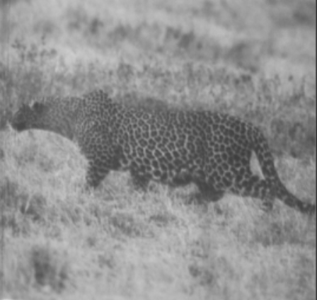
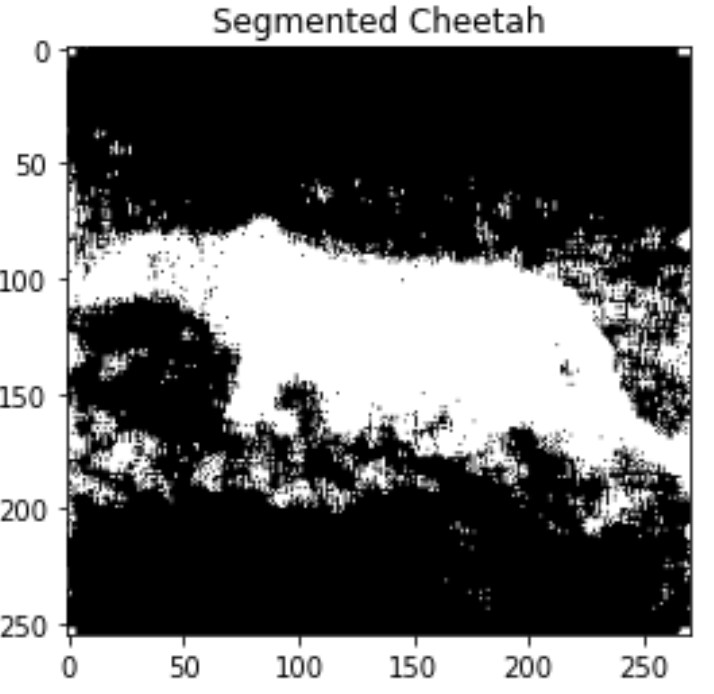

# Image Segmentation via DCT and Gaussian Models

This repository contains two notebooks that explore image segmentation and classification using Discrete Cosine Transform (DCT) and Gaussian models. This is not meant to be a recommended image segmentation method, but rather an illistration of just one of the many ways that multivariate Gaussian models can be used. 

## Overview

Notebook 1: This notebook focuses on utilizing DCT and probabilistic methods for image segmentation, effectively turning the segmentation task into a classification process. By computing DCT coefficients and applying decision rules based on probability estimates, images can be segmented into different classes, such as cheetah and grass.

Notebook 2. Building upon the concepts introduced in Notebook 1 this notbook extends the analysis to utilize multivariate Gaussian models for classification. By computing class conditional densities under the Gaussian assumption, the classification process becomes more robust and accurate. This extension enables the selection of optimal features for classification and evaluates the performance of the classification algorithm.

## Sample output 

        

## Key Concepts

### Discrete Cosine Transform (DCT): 
    
    DCT is utilized to transform image data into a representation where important features are captured
    in the frequency domain. By analyzing DCT coefficients, images can be segmented and classified based 
    on their characteristics.

### Probabilistic Methods: 
    
    Probabilistic methods are employed to estimate prior probabilities and compute class conditional densities.
    These probabilities and densities serve as the basis for making classification decisions, allowing for the 
    segmentation of images into distinct classes.

### Multivariate Gaussian Models:
    
    Notebook 2 introduces the use of multivariate Gaussian models for classification. By modeling the data distribution 
    with Gaussian distributions, the classification process becomes more sophisticated and accounts for correlations 
    between features.
